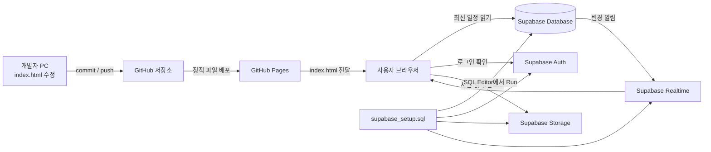

# 미국 서부 2027 여행 프로젝트 동작 설명서

> 대상 독자: 기본적인 HTML은 작성해 보았지만 JavaScript, 데이터베이스, SQL, Supabase, GitHub Pages는 익숙하지 않은 사람
> 기준 파일: 현재 저장소의 `index.html`, `supabase_setup.sql`, `README.md`, `.gitattributes`
> 작성 기준일: 2026-08-20

이 문서는 단순한 사용 설명서가 아니다. 이 프로젝트가 **어떤 부품으로 구성되어 있고**, 사용자가 버튼을 누르면 **어떤 순서로 일이 일어나며**, Supabase SQL Editor에서 `Run`을 눌렀을 때 **서버 쪽에 무엇이 만들어졌는지**를 가능한 한 쉬운 말로 설명한다.

처음 읽을 때 모든 세부 내용을 외울 필요는 없다. 우선 1~4장을 읽어 전체 그림을 잡고, 실제로 수정하거나 문제가 생겼을 때 나머지 장을 찾아보면 된다.

---

## 목차

1. [3분 요약](#1-3분-요약)
2. [가장 쉬운 비유: 여행 안내판 시스템](#2-가장-쉬운-비유-여행-안내판-시스템)
3. [전체 구조](#3-전체-구조)
4. [두 종류의 변경을 반드시 구분하기](#4-두-종류의-변경을-반드시-구분하기)
5. [디렉터리의 파일별 역할](#5-디렉터리의-파일별-역할)
6. [`index.html` 안에는 무엇이 들어 있는가](#6-indexhtml-안에는-무엇이-들어-있는가)
7. [페이지를 열었을 때의 실행 순서](#7-페이지를-열었을-때의-실행-순서)
8. [일정 데이터는 어떤 형태로 저장되는가](#8-일정-데이터는-어떤-형태로-저장되는가)
9. [보기, 로그인, 편집, 저장의 전체 흐름](#9-보기-로그인-편집-저장의-전체-흐름)
10. [실행 취소, 초기화, 자동 로그아웃](#10-실행-취소-초기화-자동-로그아웃)
11. [버전 관리와 복원](#11-버전-관리와-복원)
12. [가계부가 동작하는 방식](#12-가계부가-동작하는-방식)
13. [사진과 지도가 동작하는 방식](#13-사진과-지도가-동작하는-방식)
14. [오프라인 작업본과 보기용 HTML](#14-오프라인-작업본과-보기용-html)
15. [오프라인 작업본 불러오기](#15-오프라인-작업본-불러오기)
16. [Supabase란 무엇인가](#16-supabase란-무엇인가)
17. [SQL을 전혀 모르는 사람을 위한 기초](#17-sql을-전혀-모르는-사람을-위한-기초)
18. [`supabase_setup.sql`이 실제로 한 일](#18-supabase_setupsql이-실제로-한-일)
19. [공개 키와 비밀번호는 어떻게 다른가](#19-공개-키와-비밀번호는-어떻게-다른가)
20. [Git, GitHub, GitHub Pages의 역할](#20-git-github-github-pages의-역할)
21. [브라우저 저장소, 캐시, 실시간 동기화](#21-브라우저-저장소-캐시-실시간-동기화)
22. [무엇을 수정하면 어디에 반영되는가](#22-무엇을-수정하면-어디에-반영되는가)
23. [자주 생길 수 있는 문제와 확인 순서](#23-자주-생길-수-있는-문제와-확인-순서)
24. [안전하게 관리하는 방법](#24-안전하게-관리하는-방법)
25. [처음부터 다시 구축한다면](#25-처음부터-다시-구축한다면)
26. [용어 사전](#26-용어-사전)
27. [공식 문서](#27-공식-문서)

---

## 1. 3분 요약

이 프로젝트는 겉으로 보면 `index.html` 하나로 실행되는 웹페이지이지만, 실제로는 다음 두 장소가 협력한다.

- **GitHub Pages**는 화면의 모양과 기능이 들어 있는 `index.html`을 인터넷에 배포한다.
- **Supabase**는 사용자가 저장한 일정, 체크리스트, 가계부, 버전 기록, 사진, 로그인 정보를 인터넷 서버에 보관한다.

즉, GitHub Pages는 **앱의 몸체**, Supabase는 **앱이 사용하는 온라인 저장소와 로그인 서버**에 가깝다.

핵심 동작은 다음과 같다.

1. 누군가 공개 주소를 연다.
2. GitHub Pages가 `index.html`을 브라우저에 보내 준다.
3. 브라우저 안의 JavaScript가 실행된다.
4. JavaScript가 Supabase의 `trip_documents` 표에서 최신 저장본을 읽는다.
5. Supabase에서 읽은 내용으로 화면을 채운다.
6. 편집자는 비밀번호로 로그인한 뒤 브라우저 안에서 내용을 수정한다.
7. 수정 중인 내용은 아직 다른 사람에게 보이지 않는다.
8. 편집자가 `저장`을 확정하면 JavaScript가 Supabase의 저장 함수를 호출한다.
9. Supabase는 새 버전을 기록하고 최신 저장본을 교체한다.
10. 열려 있는 다른 사람의 페이지에는 Realtime 알림을 통해 새 저장본이 반영된다.

가장 중요한 사실은 다음 두 가지다.

> 웹페이지에서 일정을 편집하고 `저장`하는 일과, `index.html` 코드를 고쳐 GitHub에 `push`하는 일은 완전히 다른 작업이다.

> `supabase_setup.sql` 파일을 GitHub에 올리는 것만으로 SQL이 실행되지는 않는다. Supabase Dashboard의 SQL Editor에서 `Run`을 눌러야 실제 Supabase 프로젝트 안에 표, 권한, 함수, 사진 저장 공간 등이 만들어진다.

---

## 2. 가장 쉬운 비유: 여행 안내판 시스템

이 프로젝트를 여러 사람이 보는 전자 여행 안내판이라고 생각해 보자.

| 실제 기술 | 쉬운 비유 | 이 프로젝트에서 하는 일 |
|---|---|---|
| GitHub 저장소 | 안내판 설계도 보관함 | `index.html`, SQL 설정문, 설명서를 보관한다. |
| GitHub Pages | 안내판을 설치해 주는 업체 | 저장소의 HTML/CSS/JavaScript를 공개 웹주소에 배포한다. |
| `index.html` | 안내판의 틀, 버튼, 화면, 작동 장치 | 일정 UI와 모든 브라우저 동작을 담고 있다. |
| Supabase Database | 최신 여행 노트와 과거 노트 보관함 | 현재 일정과 최근 50개 저장 버전을 보관한다. |
| Supabase Auth | 편집실 출입 확인 | 올바른 이메일 계정과 비밀번호인지 확인한다. |
| Supabase Storage | 사진 창고 | 압축된 일정 사진과 미리보기를 보관한다. |
| Supabase Realtime | “새 안내문이 나왔습니다” 알림 방송 | 다른 브라우저에 새 저장본이 생겼다고 알린다. |
| SQL | 창고와 출입 규칙을 만드는 공사 지시서 | 표, 함수, 권한, 정책, 사진 버킷을 한 번에 설정한다. |
| 브라우저 `localStorage` | 각 관람객 주머니의 임시 복사본 | 서버 연결 실패에 대비한 최근 화면과 로그인 활동 시각을 저장한다. |

이 비유에서 `index.html`만 있으면 안내판의 모양은 보이지만, 여러 사람이 같은 최신 내용을 보고 편집 권한을 통제하려면 Supabase가 필요하다.

---

## 3. 전체 구조



조금 더 단순하게 쓰면 아래와 같다.

```text
화면과 기능 코드
PC의 index.html → Git → GitHub → GitHub Pages → 방문자의 브라우저

사용자가 저장한 내용
방문자의 브라우저 ↔ Supabase 데이터베이스/로그인/사진/실시간 알림
```

GitHub Pages는 정적 파일을 배포하는 서비스다. 서버에서 직접 PHP나 Python 같은 프로그램을 실행하지 않는다. 이 프로젝트에서는 복잡한 동작 대부분이 **페이지를 받은 뒤 사용자의 브라우저 안에서 JavaScript로 실행**된다. 서버에 필요한 기능은 Supabase가 대신 제공한다.

---

## 4. 두 종류의 변경을 반드시 구분하기

### 4.1 프로그램 자체를 바꾸는 변경

예를 들면 다음과 같다.

- 버튼 색상이나 배치 변경
- 새로운 기능 추가
- 사진 압축 크기 변경
- 자동 로그아웃 시간을 30분에서 다른 값으로 변경
- Supabase 프로젝트 주소 변경
- 데이터 구조나 보안 정책 변경

이런 변경은 파일의 코드를 고치는 일이다.

```text
파일 수정 → 확인 → git add → git commit → git push → GitHub Pages 재배포
```

### 4.2 여행 내용을 바꾸는 변경

예를 들면 다음과 같다.

- 1월 24일 일정 추가
- 체크리스트 문구 수정
- 가계부 항목 추가
- 환율 변경
- 일정 사진 첨부

이런 변경은 웹페이지에서 편집하고 `저장`하면 Supabase에 기록된다.

```text
웹페이지 편집 → 저장 확인 → Supabase 최신 저장본 교체 → 다른 브라우저에 반영
```

이 경우에는 보통 Git commit이나 push가 필요 없다.

### 4.3 왜 이것이 헷갈리는가

`index.html` 안에도 기본 일정 HTML이 들어 있고, Supabase에도 저장된 일정이 들어 있기 때문이다. 페이지를 처음 받는 순간에는 HTML 안의 기본 내용이 잠시 존재하지만, 시작 코드가 Supabase의 최신 저장본을 가져오면 `<main>` 영역을 그 내용으로 교체한다.

따라서 `index.html`의 기본 일정을 직접 고쳐 push했는데 화면에서 예전 일정이 보인다면, Supabase에 저장된 내용이 HTML 기본 내용을 다시 덮어쓴 것일 수 있다.

---

## 5. 디렉터리의 파일별 역할

### 5.1 `index.html`

실제 웹앱 본체다. 하나의 파일 안에 다음이 모두 들어 있다.

- HTML: 제목, 탭, 일정 카드, 대화상자 같은 화면 구조
- CSS: 색상, 크기, 반응형 모바일/PC 배치, 타임라인 모양
- JavaScript: 로그인, 편집, 저장, 버전, 가계부, 사진, 오프라인 파일 등 모든 동작

브라우저가 직접 여는 파일이며 GitHub Pages의 시작 페이지이기도 하다.

### 5.2 `supabase_setup.sql`

Supabase 서버 환경을 만드는 설정문이다. 웹페이지 방문 때마다 실행되는 파일이 아니다.

이 파일의 내용을 Supabase Dashboard의 SQL Editor에 붙여 넣고 `Run`하면 다음을 만든다.

- 최신 여행 문서 표
- 최근 저장 버전 표
- 편집자만 저장할 수 있는 함수와 권한
- 공개 읽기 정책
- 사진 저장 버킷과 업로드 정책
- 실시간 변경 알림 설정

GitHub에 이 파일을 보관하는 이유는 나중에 어떤 설정을 했는지 확인하고, 새 Supabase 프로젝트를 만들 때 같은 구조를 재현하기 위해서다.

### 5.3 `README.md`

프로젝트를 운영할 때 필요한 짧은 안내서다. 배포 주소, Supabase 초기 설정 순서, 주요 기능, 일반적인 관리 절차가 요약되어 있다.

현재 읽고 있는 `PROJECT_GUIDE_KO.md`는 README보다 훨씬 자세한 학습용 설명서다.

### 5.4 `.gitattributes`

Git이 텍스트 파일의 줄바꿈을 일관되게 관리하도록 한다.

```gitattributes
* text=auto eol=lf
```

Windows PowerShell은 흔히 CRLF 줄바꿈을 사용하고, WSL/Linux는 LF를 사용한다. 같은 내용인데도 전체 파일이 수정된 것처럼 보이는 문제를 줄이기 위해 Git에 저장할 때 LF로 통일한다.

### 5.5 `.git/`

Git의 내부 기록 폴더다. 커밋 이력, 브랜치, 원격 저장소 정보 등이 들어 있다. 사람이 직접 수정하면 저장소가 손상될 수 있으므로 열어보는 것은 괜찮지만 직접 편집하거나 삭제하지 않는다.

### 5.6 `reference.html`

UI와 기능을 비교하기 위한 참고 파일이다. 현재 `index.html`에서 불러오지 않으므로 공개 여행 페이지 실행에는 관여하지 않는다. 파일 크기도 크기 때문에 Git에 포함할지 여부는 별도로 판단해야 한다.

### 5.7 `.agents/skills/`

코딩 도구가 디자인 작업을 할 때 참고하도록 둔 지침 자료다. 브라우저나 GitHub Pages가 이 파일을 실행하지 않는다. 즉, 공개 여행 페이지의 필수 실행 파일은 아니다.

---

## 6. `index.html` 안에는 무엇이 들어 있는가

일반적인 작은 HTML은 다음 정도로 끝날 수 있다.

```html
<!doctype html>
<html>
  <head>
    <title>여행 일정</title>
  </head>
  <body>
    <h1>미국 서부 여행</h1>
  </body>
</html>
```

현재 `index.html`은 이 기본 구조에 CSS와 대규모 JavaScript가 합쳐진 **단일 파일 웹앱**이다.

### 6.1 문서 설정값

최상단 `<html>` 요소에는 프로젝트를 식별하는 값이 있다.

- `data-trip-id="us-west-2027"`: 어떤 여행 데이터인지 식별한다.
- `data-schema-version="3"`: 저장 데이터 형식의 버전이다.
- `data-offline="false"`: 온라인 원본인지 오프라인 작업본인지 표시한다.
- `data-storage-key`: 브라우저 로컬 저장소에서 사용할 키와 관련된다.

오프라인 파일을 가져올 때도 이 값들을 확인해 전혀 다른 여행 파일이 섞이지 않게 한다.

### 6.2 `<style>` 영역

CSS가 들어 있다. 다음과 같은 화면 표현을 담당한다.

- 색상, 그림자, 둥근 모서리
- 헤더와 여행 진행률
- PREP, 가계부, 날짜 탭
- 시간·점·세로선·카드로 구성된 일정 타임라인
- 편집 버튼과 모바일 화면
- 대화상자와 사진 뷰어
- 화면 너비에 따른 반응형 배치

CSS는 “무엇이 보이는가”와 “어디에 놓이는가”를 정하지만 저장이나 로그인 같은 실제 업무는 하지 않는다.

### 6.3 화면 본문

`<body>`에는 대략 다음 영역이 있다.

- 여행 제목, 기간, 진행률이 있는 헤더
- PREP/가계부/DAY 1~DAY 11을 선택하는 탭
- 편집 시작, 실행 취소, 다시 실행, 추가, 초기화, 저장, 불러오기, 내보내기, 버전 관리 버튼
- 인증, 알림, 버전, 카테고리, 지도, 가져오기, 내보내기용 대화상자
- 실제 일정과 체크리스트와 가계부를 담는 `<main>`
- 큰 사진을 보는 사진 뷰어

탭은 JavaScript 프레임워크 없이 라디오 버튼과 CSS를 활용한다. 특정 라디오 버튼이 선택되면 대응하는 패널을 보여 주는 방식이다.

### 6.4 Supabase JavaScript 라이브러리

다음과 같은 외부 스크립트를 인터넷에서 불러온다.

```html
<script src="https://cdn.jsdelivr.net/npm/@supabase/supabase-js@2"></script>
```

이 라이브러리가 있어야 브라우저 JavaScript에서 Supabase 로그인, 데이터 조회, 함수 호출, 파일 업로드, Realtime 구독을 편리하게 사용할 수 있다.

### 6.5 `offlineEmbeddedState`

온라인 원본에는 다음 값이 `null`이다.

```html
<script id="offlineEmbeddedState" type="application/json">null</script>
```

오프라인 작업본을 만들 때는 이 `null` 자리에 일정 전체를 나타내는 JSON이 들어간다. `type="application/json"`이므로 실행 코드가 아니라 데이터 보관 상자 역할을 한다.

### 6.6 `tripAppV3` JavaScript

파일 뒤쪽의 큰 JavaScript 영역이 앱의 두뇌다. 외부 프레임워크 없이 직접 작성되어 있으며 대략 다음 책임을 가진다.

- Supabase 연결
- 데이터 읽기와 화면 적용
- 로그인과 세션 확인
- 편집 모드 전환
- 저장 여부 판단
- 실행 취소/다시 실행
- 일정·체크리스트·가계부 조작
- 사진 압축과 업로드
- 지도 링크 관리
- 버전 목록과 복원
- 오프라인 작업본/보기용 파일 생성
- 작업본 비교 및 불러오기
- Realtime 동기화

`(() => { ... })();` 형태로 감싸져 있는데, 이는 내부 변수들이 다른 스크립트와 불필요하게 충돌하지 않도록 즉시 실행 함수 안에 넣은 것이다.

---

## 7. 페이지를 열었을 때의 실행 순서

페이지 하단에서 초기 장식 작업을 한 뒤 `hydrate()`라는 함수가 핵심 초기화를 수행한다. `hydrate`는 말 그대로 저장된 데이터를 화면에 “수분을 공급하듯 채운다”는 웹 개발 용어다.

### 7.1 온라인 공개 페이지의 순서

1. 브라우저가 GitHub Pages에서 `index.html`을 내려받는다.
2. HTML을 읽어 기본 화면을 만든다.
3. CSS를 적용한다.
4. Supabase JavaScript 라이브러리를 내려받는다.
5. 이 프로젝트의 JavaScript를 실행한다.
6. Supabase URL과 publishable key로 클라이언트 연결 객체를 만든다.
7. `trip_documents`에서 `trip_id = 'us-west-2027'`인 행을 요청한다.
8. 서버 저장본이 있으면 브라우저의 `<main>` 내용을 서버 저장본으로 교체한다.
9. 서버 저장본을 브라우저 `localStorage`에도 캐시한다.
10. `trip_documents`의 변경을 받는 Realtime 구독을 시작한다.
11. 현재 브라우저에 유효한 편집자 로그인 세션이 있는지 확인한다.
12. 여행 진행률을 표시하고 이후 한 시간마다 다시 계산한다.

### 7.2 Supabase 조회가 실패했을 때

네트워크 장애 등으로 서버 저장본을 읽지 못하면 브라우저 `localStorage`에 남은 최근 캐시를 사용하려고 한다. 캐시도 없다면 `index.html` 안의 기본 내용을 그대로 보여 준다.

이 캐시는 편의를 위한 보조 수단이다. 브라우저 데이터 삭제, 시크릿 창, 다른 기기에서는 없을 수 있으므로 공식 최신 저장본은 Supabase 데이터베이스다.

### 7.3 오프라인 작업본의 순서

`data-offline="true"`인 파일은 Supabase 클라이언트를 만들지 않는다.

1. HTML 안에 포함된 `offlineEmbeddedState` JSON을 읽는다.
2. 같은 오프라인 작업본의 로컬 캐시가 있으면 그것을 우선 사용할 수 있다.
3. 화면에 데이터를 적용한다.
4. 편집 내용은 해당 브라우저의 로컬 저장소에 저장한다.
5. 온라인 공개 서버에는 아무것도 전송하지 않는다.

---

## 8. 일정 데이터는 어떤 형태로 저장되는가

Supabase에는 단순 HTML만 저장하지 않는다. 전체 상태를 나타내는 JavaScript 객체를 JSON으로 바꾸어 저장한다.

개념적으로는 다음과 같다.

```json
{
  "schemaVersion": 3,
  "html": "<section class=\"day prepday\">...</section>",
  "expenses": [
    {
      "id": "expense-예시",
      "name": "공항 택시",
      "amount": 35,
      "currency": "USD",
      "date": "2027-01-25",
      "categoryId": "transport"
    }
  ],
  "categories": [
    { "id": "flight", "name": "항공", "icon": "✈️" }
  ],
  "exchangeRate": 1450,
  "exchangeRateUpdated": "2026-08-20",
  "checks": [true, false, true]
}
```

### 8.1 왜 일정은 `html` 문자열로 저장하는가

일정과 체크리스트는 이미 화면에 복잡한 HTML 구조로 존재한다. 각 문장, 카드, 날짜 제목, 사진 요소를 모두 별도의 데이터 표로 나누는 대신 `<main>` 내부 HTML을 한 덩어리 문자열로 저장하면 현재 화면 구조를 비교적 간단하게 복원할 수 있다.

장점은 구현이 간단하고 자유로운 편집 구조를 그대로 보존한다는 것이다. 단점은 HTML 구조가 바뀌면 과거 데이터와의 호환성을 신경 써야 한다는 것이다. 그래서 `schemaVersion`과 `normalizeState()`가 존재한다.

### 8.2 왜 가계부는 별도 배열인가

가계부는 합계, 통화 변환, 카테고리별 집계를 계산해야 한다. HTML 글자만 저장하는 것보다 금액, 통화, 날짜, 카테고리를 각각 속성으로 보관해야 계산하기 쉽다.

### 8.3 왜 체크 여부는 `checks` 배열인가

체크박스의 현재 체크 상태는 브라우저 DOM의 `checked` 속성으로 바뀐다. 이 값은 단순히 `innerHTML`을 읽는 것만으로 항상 정확하게 보존되지 않는다. 따라서 각 체크박스의 참/거짓 상태를 별도 배열로 저장한다.

### 8.4 `captureState()`

현재 화면을 저장 가능한 상태 객체로 만드는 함수다.

주요 작업은 다음과 같다.

- `<main>`을 복사한다.
- 편집 중에만 필요한 삭제 버튼과 도구를 복사본에서 제거한다.
- 렌더링 결과로 만들어진 가계부 목록과 요약을 비운다.
- HTML, 가계부 배열, 카테고리, 환율, 체크 상태를 한 객체로 모은다.

즉, “현재 보이는 화면을 저장용 상자에 담기”다.

### 8.5 `applyState()`

저장된 상태를 실제 화면에 되돌리는 함수다.

- 저장된 HTML을 `<main>`에 넣는다.
- 가계부와 카테고리 변수를 복원한다.
- 날짜, 체크리스트, 일정 행을 다시 꾸민다.
- 가계부를 다시 계산해 그린다.
- 체크박스 참/거짓 값을 적용한다.
- 현재 편집 모드인지에 맞춰 편집 가능 여부를 다시 설정한다.

즉, “저장 상자의 내용을 화면에 풀기”다.

### 8.6 `normalizeState()`와 가져오기 보안

`normalizeState()`는 데이터가 누락되거나 과거 형식이어도 기본값을 채우고 현재 앱이 이해할 수 있는 형태로 정리한다.

외부 HTML 작업본을 가져올 때는 `sanitizeMarkup()` 계열 처리를 통해 위험한 태그나 속성을 제거한다. 예를 들어 실행 스크립트, iframe, `onclick` 같은 이벤트 속성, 허용하지 않은 주소 형식을 걸러 낸다. 이는 가져온 HTML에 악성 JavaScript가 숨어 실행되는 위험을 줄이기 위한 방어다.

---

## 9. 보기, 로그인, 편집, 저장의 전체 흐름

### 9.1 보기 모드

공개 주소에 접근한 사람은 로그인 없이 최신 일정을 읽을 수 있다. Supabase의 Row Level Security 정책이 `trip_documents` 읽기는 익명 사용자에게 허용하기 때문이다.

다만 공개 보기와 데이터 변경 권한은 별개다. 브라우저 개발자 도구로 화면 글자를 임시로 바꾸더라도 인증된 저장 함수 호출에 성공하지 못하면 다른 사람에게 반영되지 않는다.

### 9.2 `편집 시작`을 누를 때

JavaScript의 `requireEditor()`가 현재 로그인 세션을 확인한다.

- 유효한 세션이 있고 이메일이 지정된 편집자 이메일과 같으면 비밀번호를 다시 묻지 않는다.
- 세션이 없거나 30분 비활성 시간이 지났으면 비밀번호 창을 연다.
- 입력한 비밀번호는 `signInWithPassword()`를 통해 Supabase Auth로 전송된다.
- 이 HTML 소스에는 비밀번호가 들어 있지 않다.

로그인 성공 후 `beginEditing()`은 편집을 시작하기 직전에 Supabase 최신 저장본을 한 번 더 가져온다. 오래 열어 둔 화면을 기반으로 실수로 편집하는 가능성을 줄이기 위한 것이다.

### 9.3 편집 모드

편집 가능한 일정 제목, 시간, 상세 설명 등에는 `contenteditable="true"`가 설정된다. 이것은 일반 HTML 요소를 브라우저에서 직접 타이핑할 수 있게 해 주는 기능이다.

이때의 수정은 우선 현재 브라우저 메모리와 DOM에만 있다. 아직 Supabase 최신 저장본은 바뀌지 않는다.

### 9.4 변경 여부 판단

앱은 마지막 저장 상태와 현재 `captureState()` 결과를 JSON 문자열로 비교한다.

- 같으면 변경 없음
- 다르면 저장되지 않은 초안 있음

따라서 아무것도 수정하지 않고 편집 종료를 누르면 확인창 없이 바로 종료할 수 있다.

### 9.5 편집 종료

변경이 있으면 세 가지 선택이 나타난다.

- `저장`: Supabase에 새 버전과 최신본을 기록하고 편집을 끝낸다.
- `계속 편집`: 대화상자를 닫고 편집을 이어 간다.
- `폐기`: 마지막 저장본으로 화면을 되돌리고 편집을 끝낸다.

### 9.6 저장 버튼

저장은 `persistState()`를 통해 이루어진다.

온라인 모드에서는 다음 RPC를 호출한다.

```javascript
client.rpc('save_trip_document', {
  p_trip_id: 'us-west-2027',
  p_content: 현재상태
})
```

RPC는 브라우저가 Supabase 데이터베이스 안의 미리 만든 함수를 호출하는 방식이다. 직접 표를 수정하지 않고, 권한 검사를 내장한 `save_trip_document` 함수를 통과하게 해 보안을 강화한다.

저장이 성공한 뒤에만 다음이 일어난다.

- Supabase 최신 문서가 바뀐다.
- 새 버전 기록이 생긴다.
- 브라우저의 마지막 저장 상태와 캐시가 갱신된다.
- Realtime을 통해 다른 브라우저가 업데이트를 받을 수 있다.

저장하지 않은 초안은 공개 주소에 반영되지 않는다.

---

## 10. 실행 취소, 초기화, 자동 로그아웃

### 10.1 실행 취소와 다시 실행

편집 중 상태 스냅샷을 브라우저 메모리에 쌓아 둔다.

- `실행 취소`: 이전 스냅샷으로 이동
- `다시 실행`: 취소하기 전의 다음 스냅샷으로 이동
- 최대 기록 수: 100개

이 기록은 현재 편집 세션을 편하게 하기 위한 임시 기록이다. 브라우저를 닫거나 편집 상태가 초기화되면 영구 버전처럼 기대하면 안 된다.

### 10.2 초기화

편집 모드의 `초기화`는 공장 초기화가 아니다. 확인창을 거친 뒤 **마지막으로 성공적으로 저장된 상태**로 현재 초안을 되돌린다.

초기화 이후에 다시 저장하지 않는 한 서버에는 별도의 변화가 없다.

### 10.3 30분 비활성 자동 로그아웃

편집자 세션의 앱 기준 비활성 시간은 30분이다.

- 사용 활동이 있으면 마지막 활동 시각을 갱신한다.
- 29분이 지나면 1분 경고를 표시한다.
- 변경이 있으면 `저장`, `계속 사용`, `폐기`를 선택할 수 있다.
- 1분 동안 응답이 없으면 저장되지 않은 초안을 폐기하고 로그아웃한다.
- 변경이 없으면 계속 사용하거나 로그아웃할 수 있다.

마지막 활동 시각은 `localStorage`에도 저장된다. 그래서 같은 브라우저에서 편집, 버전 관리, 가계부 변경을 할 때 30분 안의 유효한 세션이면 매번 비밀번호를 묻지 않는 것이 목표다.

여기서 Supabase 자체 로그인 토큰의 수명과 이 앱이 정한 30분 비활성 규칙은 개념적으로 다르다. 앱은 Supabase 세션이 남아 있더라도 자체 활동 시각을 검사해 30분이 지나면 로그아웃시킨다.

---

## 11. 버전 관리와 복원

### 11.1 영구 저장 버전

저장할 때마다 `trip_document_versions` 표에 그때의 전체 상태가 한 행으로 추가된다. 가장 최근 50개만 유지하며 50개를 넘으면 오래된 행부터 삭제한다.

이 기록은 실행 취소 기록과 다르다.

| 구분 | 실행 취소/다시 실행 | 버전 관리 |
|---|---|---|
| 저장 위치 | 현재 브라우저 메모리 | Supabase 데이터베이스 |
| 생성 시점 | 편집 중 변화 | 실제 저장 성공 시 |
| 최대 개수 | 100개 상태 | 최근 50개 저장본 |
| 브라우저 종료 후 | 유지 보장 안 됨 | 유지됨 |
| 공개본 복원 | 직접 하지 않음 | 선택한 버전을 새 저장본으로 복원 가능 |

### 11.2 미리보기

버전 관리에서 `미리보기`를 누르면 현재 화면을 임시로 선택한 과거 버전으로 바꿔 보여 준다. 미리보기를 닫으면 원래 화면으로 돌아간다.

### 11.3 복원

과거 버전을 복원할 때 과거 기록을 잘라내거나 삭제하지 않는다. 선택한 과거 내용을 **새 저장 버전으로 다시 저장**한다. 이 방식은 복원 전 현재 상태도 버전 이력에 남을 가능성을 유지하고, 이력의 흐름을 단순하게 만든다.

---

## 12. 가계부가 동작하는 방식

### 12.1 가계부 항목 구조

가계부 한 항목은 대략 다음 데이터를 가진다.

- 고유 ID
- 항목명
- 금액
- 통화: KRW 또는 USD
- 날짜
- 카테고리 ID

금액 입력 칸의 위·아래 증감 버튼이 보이지 않도록 일반 숫자 입력 UI를 정리해 두었다.

### 12.2 보기 모드에서 입력하는 것처럼 보이는 이유

가계부 입력 UI는 전체 일정 편집 모드가 아니어도 사용할 수 있다. 하지만 실제 데이터 변경을 시도할 때는 `requireEditor('ledger')`를 거치므로 유효한 편집자 세션이 필요하다.

즉, 전체 일정의 점선 편집 화면을 켜지 않고도 가계부를 추가할 수 있지만, 누구나 익명으로 가계부를 조작할 수 있다는 뜻은 아니다.

가계부 변경 역시 초안이므로 최종적으로 `저장`해야 다른 사람에게 공개된다.

### 12.3 통화와 환율

각 항목마다 KRW 또는 USD를 선택한다. 페이지 전체 통화를 바꾸는 것이 아니라 해당 금액이 어떤 통화인지 저장한다.

환율은 가계부 상단에서 직접 입력하며 자동 금융 API를 사용하지 않는다. USD 금액을 원화 환산할 때 다음 개념으로 계산한다.

```text
원화 환산액 = USD 금액 × 입력한 KRW/USD 환율
```

원화와 달러가 혼재되어 있으면 원화 환산 총액을 함께 표시한다. 환율이 수동 값이므로 계산 결과의 정확도도 입력한 환율에 달려 있다.

### 12.4 카테고리

편집 모드에서 카테고리를 추가하거나 이름과 아이콘을 바꾸고 삭제할 수 있다.

카테고리를 삭제하면 그 카테고리를 사용하던 가계부 항목 자체를 삭제하지 않는다. 해당 항목들의 카테고리 ID를 시스템 카테고리인 `삭제된 카테고리`로 바꾼다. 지출 기록을 잃지 않기 위한 처리다.

### 12.5 삭제 확인

가계부 항목 삭제는 복구가 필요한 실수가 되기 쉬우므로 확인 과정을 거친다. 삭제 후에도 아직 서버 저장 전이라면 마지막 저장본으로 초기화하거나 편집 종료 시 폐기할 수 있다.

---

## 13. 사진과 지도가 동작하는 방식

### 13.1 사진을 바로 원본으로 올리지 않는 이유

휴대전화 사진은 한 장이 수 MB에서 수십 MB가 될 수 있다. 모든 방문자가 큰 원본을 받으면 데이터 사용량과 로딩 시간이 커진다. 그래서 브라우저에서 먼저 압축한다.

현재 흐름은 다음과 같다.

1. 일정 행에서 사진 추가를 선택한다.
2. 선택한 각 원본 파일이 20MB를 넘는지 확인한다.
3. 브라우저에서 이미지를 해석한다.
4. 큰 보기용 이미지를 최대 변 1600px의 WebP로 만든다.
5. 목록용 썸네일을 최대 변 480px의 WebP로 만든다.
6. 압축된 파일 내용의 SHA-256 해시를 계산한다.
7. 해시를 포함한 경로로 Supabase Storage에 업로드한다.
8. 일정 JSON/HTML에는 사진 자체 대신 Storage 경로와 공개 URL을 기록한다.

사진 개수에는 앱 차원의 고정 제한을 두지 않았지만, 사진이 많을수록 Storage 용량, 오프라인 내보내기 파일 크기, 브라우저 메모리 사용량이 늘어난다.

### 13.2 해시 기반 파일명과 캐시

개념적인 저장 경로는 다음과 같다.

```text
us-west-2027/photos/<압축 이미지의 해시>.webp
us-west-2027/thumbs/<압축 이미지의 해시>.webp
```

내용이 완전히 같은 압축 이미지는 같은 해시를 만든다. 업로드 전에 같은 경로가 이미 있는지 확인하므로 중복 업로드를 줄일 수 있다.

또한 파일 내용이 바뀌면 해시와 URL도 바뀌고, 바뀌지 않으면 URL도 그대로다. 브라우저는 긴 캐시 기간을 이용해 같은 URL의 사진을 다시 내려받지 않을 수 있다. “사진이 바뀌었을 때만 새 파일을 받는다”는 목적에 적합한 구조다.

### 13.3 썸네일 지연 로딩

일정 화면에서는 작은 썸네일을 사용하고 지연 로딩을 적용한다. 큰 이미지는 사용자가 사진을 눌러 뷰어를 열 때만 요청한다. 이것도 데이터 사용량을 줄인다.

### 13.4 화면에서 사진을 삭제할 때

사진 삭제는 일정 문서에서 그 사진에 대한 참조를 제거한다. Storage의 실제 파일은 즉시 삭제하지 않는다.

이유는 과거 50개 버전이 그 사진을 여전히 참조할 수 있기 때문이다. 실제 Storage 파일을 지워 버리면 과거 버전을 미리보거나 복원했을 때 사진이 깨진다.

단점은 시간이 지나면 사용하지 않는 파일이 쌓일 수 있다는 것이다. 수동 정리를 할 때는 현재 저장본과 보관된 50개 버전 어디에서도 참조하지 않는 파일인지 확인해야 한다.

### 13.5 지도

지도는 지도 데이터 자체를 저장하지 않는다. 일정마다 다음만 기록한다.

- 장소명
- `https://`로 시작하는 외부 지도 링크

사용자가 링크를 열면 Google Maps 등 외부 서비스로 이동한다. 따라서 지도 열기에는 인터넷이 필요하다.

---

## 14. 오프라인 작업본과 보기용 HTML

두 파일은 이름은 모두 HTML이지만 목적이 다르다.

### 14.1 오프라인 작업본

파일명 예시는 다음과 같다.

```text
US_West_2027_EDITABLE_2026-08-20.html
```

목적은 인터넷이 없는 곳에서도 수정할 수 있는 **작업 파일**을 만드는 것이다.

생성할 때 하는 일은 다음과 같다.

- 현재 전체 상태를 HTML 안의 JSON으로 삽입한다.
- 일정 사진을 인터넷 URL 대신 Base64 데이터로 HTML 내부에 포함한다.
- Supabase 외부 스크립트를 제거한다.
- `data-offline="true"`로 표시한다.
- 오프라인 작업본임을 알리는 배너를 넣는다.

사진까지 한 파일에 넣으므로 오프라인에서도 보이지만 파일 크기가 매우 커질 수 있다. 100MB를 넘으면 경고 후 계속할지 확인한다.

오프라인에서 저장하면 Supabase에 보내는 대신 로컬 상태를 저장하고 수정된 새 작업본 HTML을 내려받는다.

### 14.2 보기용 HTML

파일명 예시는 다음과 같다.

```text
US_West_2027_VIEW_ONLY_2026-08-20.html
```

목적은 인쇄하거나 다른 사람에게 전달하는 **읽기 전용 사본**을 만드는 것이다.

생성할 때 다음을 제거하거나 비활성화한다.

- 모든 실행 스크립트
- 편집 도구
- 로그인/버전/알림 대화상자
- 가계부 입력과 삭제 UI
- 체크박스 조작

이 파일은 편집본으로 다시 가져오기 위한 파일이 아니다. 사진 URL과 지도 링크는 그대로일 수 있어 인터넷이 필요한 부분이 있다.

### 14.3 차이 요약

| 항목 | 오프라인 작업본 | 보기용 HTML |
|---|---|---|
| 주목적 | 인터넷 없이 편집 | 읽기, 전달, 인쇄 |
| 편집 기능 | 있음 | 없음 |
| 사진 포함 | Base64로 파일 내부 포함 | 주로 온라인 URL 유지 |
| Supabase 연결 | 없음 | 없음 |
| 온라인 원본으로 가져오기 | 가능 | 불가능 |
| 저장 결과 | 새 작업본 파일 다운로드 | 해당 없음 |
| 파일 크기 | 사진 수에 따라 매우 큼 | 상대적으로 작음 |

---

## 15. 오프라인 작업본 불러오기

온라인 페이지의 `편집본 불러오기`는 아무 HTML이나 덮어쓰지 않는다.

### 15.1 기본 검사

- 이 프로젝트의 `trip_id`와 같은가
- `data-offline="true"`인 작업본인가
- 저장 데이터가 들어 있는가
- 파일의 스키마 버전이 현재 앱보다 너무 새롭지 않은가
- 가져온 HTML에 위험한 스크립트나 속성이 없는가

### 15.2 최신 저장본과 차이 비교

가져온 작업본과 현재 Supabase 최신 저장본을 비교해 다음 그룹의 차이를 보여 준다.

- 일정
- 체크리스트
- 가계부
- 카테고리
- 환율

사용자가 내용을 확인하고 적용을 선택해야 다음 단계로 간다.

### 15.3 비교 중 다른 사람이 저장한 경우

처음 비교한 뒤 실제 적용 직전에 Supabase의 `updated_at`을 다시 확인한다. 그 사이 최신 저장본이 바뀌었다면 즉시 덮어쓰지 않고 새 기준으로 차이를 다시 계산해 한 번 더 확인하게 한다.

### 15.4 포함된 사진 처리

오프라인 작업본 안에 Base64로 포함된 새 사진은 온라인 Storage에 사용할 수 있는 WebP 파일로 다시 압축·업로드하고, HTML 내부 참조를 Storage URL로 바꾼다.

### 15.5 적용과 저장은 다르다

불러오기를 적용해도 우선 브라우저의 **초안**으로 들어올 뿐이다. 최종 `저장`을 해야 Supabase 최신본과 공개 페이지에 반영된다.

---

## 16. Supabase란 무엇인가

Supabase는 웹앱이 자주 필요로 하는 서버 기능을 한 프로젝트 안에서 제공하는 관리형 서비스다. 이 프로젝트에서는 다음 기능을 사용한다.

### 16.1 Database

PostgreSQL이라는 관계형 데이터베이스다. 현재 문서와 버전 기록을 표 형태로 저장한다. 일정 내용 자체는 `jsonb`라는 JSON 저장 형식을 사용한다.

### 16.2 Auth

사용자 계정과 비밀번호 로그인을 처리한다. 편집자 비밀번호를 HTML에 넣지 않고 Supabase가 검증한다.

### 16.3 Storage

사진 같은 파일을 저장한다. 데이터베이스에는 사진 경로를 저장하고 실제 WebP 파일은 Storage 버킷에 둔다.

### 16.4 Realtime

데이터베이스 행이 바뀌었을 때 연결된 브라우저에 변경 이벤트를 전달한다. 누군가 저장하면 다른 사람이 새로고침하지 않아도 새 저장본을 받을 수 있게 한다.

### 16.5 API와 JavaScript 클라이언트

Supabase는 데이터베이스와 Auth/Storage 기능을 웹에서 호출할 수 있는 API를 자동 제공한다. `@supabase/supabase-js` 라이브러리는 이 API를 JavaScript 함수처럼 사용하게 해 준다.

이 프로젝트 폴더 안에 별도의 Node.js, Python, PHP 서버 프로그램이 없는 이유가 이것이다. 서버 역할의 상당 부분을 외부 Supabase 프로젝트가 담당한다.

---

## 17. SQL을 전혀 모르는 사람을 위한 기초

### 17.1 SQL이란

SQL은 데이터베이스에 구조를 만들거나 데이터를 읽고 변경하도록 지시하는 언어다. HTML이 화면 구조를 표현한다면 SQL은 데이터 보관함의 구조와 규칙을 표현한다고 생각하면 된다.

예를 들어 다음 SQL은 `example`이라는 표를 만든다는 뜻이다.

```sql
create table example (
  id bigint primary key,
  name text not null
);
```

### 17.2 데이터베이스, 표, 행, 열

엑셀에 비유하면 이해하기 쉽다.

| 데이터베이스 용어 | 엑셀 비유 | 예시 |
|---|---|---|
| Database | 통합 문서 | 이 Supabase 프로젝트의 PostgreSQL |
| Table | 시트 | `trip_documents` |
| Row | 한 줄 | `us-west-2027` 여행 한 건 |
| Column | 열 | `trip_id`, `content`, `updated_at` |

다만 데이터베이스는 엑셀보다 자료형, 관계, 권한, 동시 접근 규칙이 엄격하다.

### 17.3 자주 나오는 자료형

- `text`: 글자
- `uuid`: 매우 긴 고유 식별자. 편집자 계정 ID에 사용한다.
- `bigint`: 큰 정수. 버전 번호에 사용한다.
- `jsonb`: JSON 구조를 데이터베이스가 다루기 좋은 형태로 저장한다.
- `timestamptz`: 시간대 정보를 고려한 날짜와 시각이다.

### 17.4 기본 키와 외래 키

- `primary key`: 표에서 각 행을 유일하게 찾는 값이다. `trip_documents.trip_id`가 해당한다.
- `foreign key`: 다른 표의 행과 연결하는 값이다. 버전 표의 `trip_id`는 최신 문서 표의 `trip_id`를 참조한다.

### 17.5 함수

데이터베이스 안에 저장해 두는 작은 프로그램이다. 이 프로젝트의 `save_trip_document()` 함수는 권한 검사, 버전 추가, 최신본 교체, 50개 정리를 한 번의 안전한 작업으로 묶는다.

### 17.6 트리거

특정 사건이 생기면 자동으로 실행되는 장치다. 최신 문서가 수정되기 직전에 `updated_at`을 현재 시각으로 바꾸는 트리거가 있다.

### 17.7 RLS와 정책

RLS는 Row Level Security의 약자로, “어떤 사용자가 어떤 행을 읽거나 바꿀 수 있는가”를 데이터베이스가 직접 검사하는 기능이다.

정책은 RLS의 구체적인 규칙이다.

- 최신 여행 문서: 누구나 읽기 가능
- 버전 기록: 지정 편집자만 읽기 가능
- 사진 업로드: 지정 편집자만 가능
- 최신 문서 직접 수정: 허용하지 않고 저장 함수만 사용

브라우저 UI에서 버튼을 숨기는 것만으로는 보안이 되지 않는다. 사용자가 개발자 도구나 직접 API 호출을 사용할 수도 있기 때문이다. RLS와 데이터베이스 함수가 서버 쪽에서 최종 권한을 검사해야 한다.

### 17.8 `auth.uid()`

현재 Supabase에 로그인한 사용자의 고유 UUID를 돌려주는 값이다. SQL은 이 UUID가 `trip_documents.editor_id`와 같은지 비교한다. 이메일 문자열만 믿고 저장하는 것이 아니다.

### 17.9 RPC

Remote Procedure Call의 약자다. 브라우저에서 데이터베이스 함수를 이름과 인수로 호출하는 것이다. 이 프로젝트에서는 `save_trip_document`를 호출한다.

### 17.10 `security definer`

데이터베이스 함수가 그 함수를 만든 사람의 권한으로 필요한 작업을 수행하도록 하는 설정이다. 강력할 수 있기 때문에 함수 안에서 반드시 호출자를 다시 확인해야 한다.

현재 함수는 `auth.uid()`가 이 여행의 `editor_id`와 같은지 검사한 뒤에만 버전 추가와 문서 갱신을 수행한다. 또한 일반 사용자의 직접 `UPDATE` 권한은 취소되어 있다. 즉, 강한 권한을 아무 데나 열지 않고 검증된 저장 통로 하나에 집중한 구조다.

---

## 18. `supabase_setup.sql`이 실제로 한 일

Supabase SQL Editor에서 이 파일을 붙여 넣고 `Run`을 눌렀다는 것은, 아래 명령들을 **인터넷에 있는 해당 Supabase 프로젝트의 PostgreSQL 데이터베이스에서 실행했다**는 뜻이다.

로컬 PC에서 HTML을 실행한 것도 아니고, GitHub Pages를 다시 배포한 것도 아니다.

### 18.1 사전 조건: 편집자 계정

파일 첫 주석에는 먼저 Authentication의 Users에서 `pca01008@gmail.com` 계정을 만들라고 적혀 있다.

뒤의 초기 문서 생성문이 `auth.users`에서 해당 이메일의 UUID를 찾기 때문이다. 계정이 없다면 선택 결과가 없어서 초기 `us-west-2027` 문서 행이 만들어지지 않을 수 있다.

### 18.2 최신 문서 표 생성

`public.trip_documents` 표를 만든다.

| 열 | 의미 |
|---|---|
| `trip_id` | 여행 고유 이름. 현재는 `us-west-2027` |
| `content` | 일정 전체 상태 JSON |
| `editor_id` | 이 여행을 저장할 수 있는 Auth 사용자 UUID |
| `updated_at` | 마지막 저장 시각 |

`trip_id`가 기본 키이므로 같은 여행 ID의 최신 문서는 한 행만 존재한다.

### 18.3 수정 시각 트리거 생성

`set_trip_document_updated_at()` 함수를 만들고 `trip_documents`가 업데이트되기 직전에 자동 실행하도록 트리거를 연결한다.

JavaScript가 시간을 직접 보내지 않아도 데이터베이스 서버 시각으로 `updated_at = now()`가 된다.

### 18.4 초기 여행 행 생성

Auth 사용자 중 이메일이 `pca01008@gmail.com`인 사용자의 UUID를 찾아 `trip_id = 'us-west-2027'` 행을 만든다.

`on conflict (trip_id) do nothing`이 있으므로 같은 여행 행이 이미 있으면 덮어쓰지 않는다.

### 18.5 최신 문서 RLS와 읽기 권한

RLS를 켜고 `anon`, `authenticated` 역할 모두에게 `SELECT`를 허용한다. 그리고 `using (true)` 정책으로 모든 사람이 최신 여행 행을 읽을 수 있게 한다.

이것이 로그인하지 않은 사람도 공개 여행 페이지를 볼 수 있는 서버 쪽 근거다.

반면 인증 사용자에게 직접 `UPDATE` 권한은 주지 않는다. 저장은 뒤에서 만드는 통제된 함수만 사용한다.

### 18.6 버전 표 생성

`public.trip_document_versions` 표를 만든다.

| 열 | 의미 |
|---|---|
| `id` | 자동 증가하는 버전 ID |
| `trip_id` | 어느 여행의 버전인지 |
| `content` | 그때 저장한 전체 상태 JSON |
| `created_by` | 저장한 Auth 사용자 UUID |
| `created_at` | 저장 시각 |

최신순 버전 조회가 빨라지도록 인덱스도 만든다.

### 18.7 버전 표 보안

- 익명 사용자에게는 모든 권한을 취소한다.
- 로그인 사용자에게 조회 권한을 주되 RLS 정책으로 다시 제한한다.
- 현재 사용자의 `auth.uid()`가 해당 여행의 `editor_id`와 같을 때만 읽을 수 있다.

따라서 공개 방문자는 현재 공개본은 볼 수 있지만 과거 버전 목록은 볼 수 없다.

### 18.8 저장 함수 생성

`save_trip_document(p_trip_id, p_content)`가 저장의 핵심이다.

내부 순서는 다음과 같다.

1. 해당 여행 행을 찾고 작업 중 다른 저장과 충돌하지 않도록 잠근다.
2. 문서의 `editor_id`를 읽는다.
3. 현재 로그인 사용자의 `auth.uid()`와 다르면 오류를 낸다.
4. 전달받은 새 상태를 버전 표에 삽입한다.
5. 최신 문서 표의 `content`도 같은 새 상태로 업데이트한다.
6. 버전을 최신순으로 50개만 남기고 오래된 행을 삭제한다.
7. 새 버전 ID와 업데이트 시각을 JSON으로 돌려준다.

함수 실행 권한은 `authenticated`에만 주고 `public`, `anon`에서는 취소한다.

### 18.9 사진 버킷 생성

Supabase Storage에 `trip-media` 버킷을 만든다.

설정은 다음과 같다.

- 공개 버킷
- 저장 파일 한 개의 최대 크기 5MB
- 허용 MIME 형식은 `image/webp`

브라우저에서 선택 가능한 원본의 제한은 20MB지만, Storage에 실제로 올리는 것은 압축된 WebP이며 5MB 이하여야 한다.

### 18.10 사진 접근 정책

공개 버킷이므로 URL을 아는 방문자는 사진을 볼 수 있다. 별도의 익명 `SELECT` 정책을 만들지 않아 버킷 전체 파일 목록을 익명으로 나열하는 것은 막는다.

업로드 `INSERT`는 다음 조건을 모두 만족해야 한다.

- 로그인한 사용자
- `trip-media` 버킷
- 경로가 `us-west-2027/`로 시작
- 사용자의 UUID가 이 여행의 `editor_id`와 같음

`UPDATE`와 `DELETE` 정책은 만들지 않는다. 앱도 기존 사진 파일을 덮어쓰거나 삭제하지 않는다. 해시 기반 새 파일을 만들고 과거 버전의 사진 참조를 보존하기 위한 결정이다.

### 18.11 Realtime 설정

`supabase_realtime` publication이 없으면 만들고, `trip_documents` 표가 포함되지 않았으면 추가한다.

publication은 PostgreSQL 변경 내용을 Realtime 시스템이 전달할 수 있도록 공개할 표의 목록에 가깝다. 이 설정 덕분에 JavaScript가 `trip_documents`의 `UPDATE` 이벤트를 구독할 수 있다.

### 18.12 같은 SQL을 다시 Run하면 어떻게 되는가

파일은 상당 부분 다시 실행할 수 있도록 작성되어 있다.

- `create table if not exists`: 표가 없을 때만 생성
- `create or replace function`: 함수를 최신 정의로 교체
- `drop policy if exists` 후 `create policy`: 정책을 다시 설정
- `on conflict ... do nothing/update`: 기존 행이나 버킷을 무작정 중복 생성하지 않음
- Realtime publication과 표 포함 여부를 검사

일반적인 재실행으로 최신 여행 내용이 초기화되도록 작성되어 있지는 않다. 하지만 권한, 함수, 버킷 설정은 SQL 내용에 맞게 다시 설정될 수 있다. 계정이 없거나 실행 권한이 부족하거나 Supabase 측 구조가 달라졌다면 오류가 날 수 있으므로 실행 결과 메시지를 확인해야 한다.

### 18.13 GitHub에 SQL 파일을 push하면 자동 실행되는가

아니다. 현재 저장소에는 SQL을 자동으로 Supabase에 배포하는 CI/CD 설정이 없다.

```text
supabase_setup.sql 수정 + GitHub push
→ GitHub에 텍스트 파일이 바뀔 뿐
→ Supabase 데이터베이스 설정은 그대로
```

Supabase 설정을 실제로 바꾸려면 SQL Editor에서 새 SQL을 직접 실행하거나 별도의 Supabase CLI/자동 배포 체계를 구축해야 한다.

---

## 19. 공개 키와 비밀번호는 어떻게 다른가

`index.html`에는 다음 종류의 값이 들어 있다.

- Supabase 프로젝트 URL
- Supabase publishable key
- 편집자 이메일

이 값들은 브라우저가 Supabase 프로젝트를 찾고 공개 API를 호출하기 위한 정보다. 웹페이지 소스는 방문자에게 전달되므로 이 값들은 누구나 볼 수 있다고 전제해야 한다.

### 19.1 publishable key가 보여도 되는 이유

publishable key는 브라우저 같은 공개 환경에서 사용하도록 만들어진 프로젝트 식별용 키다. 이 키 자체를 비밀번호처럼 믿지 않는다. 실제 데이터 접근 가능 여부는 로그인 상태, RLS, Storage 정책, 함수 권한이 결정한다.

그래서 이 프로젝트는 다음처럼 방어한다.

- 공개 최신 일정 읽기만 익명 허용
- 직접 문서 업데이트 권한 취소
- 저장 함수는 로그인 사용자만 호출
- 함수 안에서 편집자 UUID 재검사
- 버전 목록은 편집자만 조회
- 사진 업로드도 편집자 UUID 재검사

### 19.2 절대 넣으면 안 되는 값

다음은 `index.html`, GitHub 저장소, 공개 채팅에 넣으면 안 된다.

- 편집자 비밀번호
- Supabase secret key 또는 `service_role` 키
- 데이터베이스 직접 접속 비밀번호
- 다른 서비스의 비밀 API 키

특히 service role 계열 비밀 키는 RLS를 우회할 수 있으므로 브라우저 코드에 들어가면 매우 위험하다.

### 19.3 편집자 이메일은 보안 비밀인가

현재 이메일은 JavaScript에 있으므로 공개 정보로 취급해야 한다. 이메일 자체가 저장 권한을 주는 것은 아니다. 비밀번호 로그인 후 얻은 사용자 UUID와 데이터베이스에 기록된 `editor_id`가 일치해야 저장할 수 있다.

### 19.4 사진과 일정의 공개 범위

이 프로젝트는 공개 여행 페이지를 목표로 하므로 최신 일정과 공개 사진 URL도 사실상 공개 정보다. 여권번호, 예약번호 전체, 개인 전화번호, 결제 정보처럼 민감한 내용은 일정이나 사진에 넣지 않는 것이 안전하다.

---

## 20. Git, GitHub, GitHub Pages의 역할

### 20.1 Git

로컬 파일의 변경 이력을 남기는 도구다.

- 어떤 파일이 바뀌었는지 확인
- 변경 묶음을 커밋으로 기록
- 이전 코드와 비교
- 협업 시 변경 이력 공유

Git은 Supabase 데이터베이스의 여행 저장본을 자동 기록하지 않는다. Git이 관리하는 것은 이 디렉터리의 파일이다.

### 20.2 GitHub

Git 저장소를 인터넷에 보관하는 서비스다. 로컬 커밋을 `push`하면 GitHub 저장소에 올라간다.

### 20.3 GitHub Pages

GitHub 저장소의 HTML, CSS, JavaScript 같은 정적 파일을 공개 웹사이트로 제공한다. 이 프로젝트 주소는 프로젝트 저장소 이름을 경로로 사용하는 Pages 형태다.

코드를 push한 직후 배포에 약간의 시간이 걸릴 수 있다. 배포가 끝났는데도 예전 코드가 보이면 브라우저 캐시를 새로고침하고 GitHub의 Pages/Actions 상태를 확인한다.

### 20.4 기본 코드가 바뀌어도 Supabase 내용은 별개다

다시 강조하면 다음 두 저장 장소는 독립적이다.

```text
GitHub: 앱 코드와 기본 HTML
Supabase: 사용자가 저장한 최신 여행 상태와 버전과 사진
```

`index.html`을 과거 커밋으로 되돌려도 Supabase 최신 데이터가 자동으로 과거로 돌아가지는 않는다. 반대로 Supabase 버전을 복원해도 GitHub의 코드 커밋은 바뀌지 않는다.

---

## 21. 브라우저 저장소, 캐시, 실시간 동기화

### 21.1 `localStorage`

브라우저가 사이트별로 작은 문자열 데이터를 저장하는 공간이다. 이 앱은 대략 다음 용도로 사용한다.

- 최근 성공적으로 읽거나 저장한 여행 상태 캐시
- 오프라인 작업본 상태
- 편집자의 마지막 활동 시각

`localStorage`는 다음 이유로 공식 백업이 아니다.

- 브라우저 데이터 삭제 시 사라진다.
- 다른 브라우저나 다른 기기와 공유되지 않는다.
- 시크릿 모드에서는 수명이 짧다.
- 사용자가 직접 조작할 수 있다.

### 21.2 이미지 HTTP 캐시

해시 기반 사진 URL과 긴 `cacheControl` 설정 덕분에 브라우저는 같은 사진을 로컬 캐시에서 재사용할 수 있다. 사진 내용이 바뀌면 새 해시 URL이 생기므로 새 파일을 받는다.

이 캐시는 `localStorage`와 다른 브라우저의 네트워크 캐시다.

### 21.3 Realtime 업데이트를 바로 적용하지 않는 경우

다른 사람이 저장해 UPDATE 이벤트가 와도 다음 상태에서는 자동으로 화면을 덮어쓰지 않는다.

- 현재 편집 중
- 저장하지 않은 초안이 있음
- 과거 버전 미리보기 중

사용자의 작업을 갑자기 지우지 않기 위한 보호다. 평범한 보기 모드일 때는 새 저장본을 적용하고 상태 문구를 표시한다.

### 21.4 Realtime이 끊겨도 저장본은 남는다

Realtime은 변경 알림 통로다. 알림이 일시적으로 실패해도 데이터베이스 저장 자체가 성공했다면 새로고침 시 최신 문서를 다시 읽을 수 있다.

---

## 22. 무엇을 수정하면 어디에 반영되는가

| 하고 싶은 일 | 실제 수정 장소 | 필요한 최종 동작 | 결과가 나타나는 곳 |
|---|---|---|---|
| 일정 문장 변경 | 공개 웹페이지 편집 모드 | `저장` | Supabase와 모든 방문자 화면 |
| 체크리스트 변경 | 공개 웹페이지 편집 모드 | `저장` | Supabase |
| 가계부 추가 | 공개 웹페이지 가계부 | 로그인 후 `저장` | Supabase |
| 사진 추가 | 공개 웹페이지 편집 모드 | 업로드 후 `저장` | Storage + Database |
| 색상 변경 | `index.html` CSS | commit + push | GitHub Pages 재배포 후 |
| 버튼 기능 변경 | `index.html` JavaScript | commit + push | GitHub Pages 재배포 후 |
| 자동 로그아웃 시간 변경 | `index.html` 상수 | commit + push | GitHub Pages 재배포 후 |
| 저장 권한 규칙 변경 | `supabase_setup.sql` 또는 별도 SQL | Supabase SQL Editor에서 Run | Supabase 서버 |
| 설명서 변경 | `.md` 파일 | 공유하려면 commit + push | GitHub 저장소 |
| 과거 여행 내용 복원 | 웹페이지 버전 관리 | 복원 확인 | Supabase에 새 버전으로 저장 |
| 코드 과거 버전 복원 | Git | 되돌림 커밋 + push | GitHub Pages 코드 |

---

## 23. 자주 생길 수 있는 문제와 확인 순서

### 23.1 GitHub에 push했는데 공개 페이지가 안 바뀐다

확인 순서:

1. 올바른 저장소와 브랜치에 push했는지 확인한다.
2. GitHub Pages 배포 소스가 그 브랜치/폴더인지 확인한다.
3. GitHub Actions 또는 Pages 배포가 성공했는지 확인한다.
4. 몇 분 기다린 뒤 강력 새로고침한다.
5. 코드가 아니라 일정 데이터 변경이었다면 웹페이지에서 `저장`했는지 확인한다.

### 23.2 `index.html` 일정을 고쳐 push했는데 예전 일정이 보인다

Supabase의 `trip_documents.content`가 페이지 시작 후 `<main>`을 덮어쓰고 있을 가능성이 높다.

프로그램 기본값을 바꾼 것인지, 실제 공개 저장 데이터를 바꾸려는 것인지 구분한다. 실제 여행 내용을 바꾸려면 웹페이지 편집 모드에서 수정하고 저장하는 것이 일반적이다.

### 23.3 편집 시작 때 로그인이 안 된다

확인할 것:

- Supabase Authentication에 편집자 계정이 존재하는가
- 이메일이 `index.html`의 `EDITOR_EMAIL`과 같은가
- 비밀번호가 맞는가
- Supabase URL과 publishable key가 현재 프로젝트 것인가
- 브라우저 콘솔/네트워크에 연결 오류가 있는가

### 23.4 로그인은 되지만 저장이 실패한다

확인할 것:

- `supabase_setup.sql`의 최신 저장 함수가 실제 프로젝트에서 실행되었는가
- `trip_documents`에 `us-west-2027` 행이 존재하는가
- 그 행의 `editor_id`가 로그인 계정 UUID와 같은가
- `save_trip_document` 실행 권한과 정의가 올바른가
- RLS/권한 설정 중 오류가 없었는가
- 네트워크가 연결되어 있는가

페이지 상태 문구에 `저장 실패 · Supabase 설정 확인`이 보이면 개발자 콘솔의 실제 Supabase 오류가 원인 파악에 도움이 된다.

### 23.5 SQL을 Run했는데 가계부나 버튼이 바로 나타나지 않는다

SQL은 서버의 표와 권한을 만든다. 가계부 탭이나 버튼 UI는 `index.html` 코드에 있다. UI 변경은 코드가 포함된 커밋을 GitHub Pages가 배포해야 보인다.

즉, SQL 실행만으로 HTML 화면 구조는 바뀌지 않는다.

### 23.6 사진 업로드가 실패한다

확인할 것:

- 로그인한 편집자인가
- 원본 선택 파일이 20MB 이하인가
- 브라우저 압축 결과가 Storage의 5MB 제한 이하인가
- 파일이 이미지이고 WebP 변환을 지원하는 브라우저인가
- `trip-media` 버킷과 INSERT 정책이 생성되었는가
- 경로가 `us-west-2027/` 아래인가
- 네트워크가 정상인가

### 23.7 다른 사람이 저장한 내용이 즉시 안 보인다

확인할 것:

- 편집자가 실제로 `저장`까지 했는가
- 보는 사람이 편집 중, 초안 보유 중, 버전 미리보기 중인가
- Realtime 설정이 SQL로 적용되었는가
- 네트워크 연결이 살아 있는가
- 새로고침하면 최신 내용이 보이는가

새로고침으로 보인다면 데이터 저장은 성공했고 Realtime 알림만 일시적으로 적용되지 않았을 가능성이 있다.

### 23.8 계속 비밀번호를 묻는다

확인할 것:

- 같은 브라우저와 같은 사이트 주소를 사용하고 있는가
- 쿠키/사이트 저장 데이터가 차단되거나 삭제되지 않았는가
- 30분 동안 활동이 없었는가
- Supabase 세션이 만료되거나 로그아웃되었는가
- 로컬 `file://`과 GitHub Pages `https://`를 번갈아 사용하고 있지 않은가

서로 다른 주소는 브라우저 저장 공간과 로그인 세션이 분리될 수 있다.

### 23.9 버전 목록이 안 보인다

버전 표는 공개 읽기가 아니다. 편집자로 로그인했는지, 버전 표와 정책이 SQL로 만들어졌는지 확인한다. 아직 한 번도 저장하지 않았다면 목록이 비어 있을 수 있다.

### 23.10 오프라인 파일이 너무 크다

사진을 Base64로 HTML 안에 넣으면 원본 이진 파일보다 문자열 크기가 더 커지고 사진 수만큼 누적된다. 필요한 사진만 포함한 시점에 작업본을 만들거나, 용량이 큰 경우 기기의 여유 공간과 브라우저 성능을 고려한다.

### 23.11 PowerShell과 WSL에서 전체 파일이 수정된 것처럼 보인다

줄바꿈 방식 차이일 수 있다. `.gitattributes`가 LF를 강제하므로 Git 설정을 적용해 다시 체크아웃한 뒤 실제 내용 차이인지 확인한다. 단순 줄바꿈 변경과 사용자 코드 변경을 섞어 커밋하지 않는 것이 좋다.

---

## 24. 안전하게 관리하는 방법

### 24.1 수정 전에 확인할 것

- `git status`로 기존 사용자 변경이 있는지 본다.
- `git diff`로 코드 변화인지 줄바꿈 변화인지 본다.
- UI 코드 변경과 Supabase SQL 변경을 구분한다.
- 민감 정보가 파일에 들어가지 않았는지 확인한다.

### 24.2 코드 변경 후 확인할 것

- PC와 모바일 너비에서 탭과 일정이 읽기 쉬운가
- 공개 보기 모드에서 편집 버튼 외의 수정 도구가 숨는가
- 편집 시작/종료/폐기/저장이 의도대로 동작하는가
- 저장하지 않은 내용이 다른 브라우저에 보이지 않는가
- 저장한 뒤 다른 브라우저나 시크릿 창에서 보이는가
- 가계부 합계와 환율 계산이 맞는가
- 사진 썸네일과 큰 사진이 모두 보이는가
- 버전 복원 후 새 버전이 생기는가
- 오프라인 작업본과 보기용 파일이 각각 목적에 맞게 열리는가

### 24.3 SQL 변경 시 주의할 것

- 실행 전 SQL 전체를 읽는다.
- `drop table`, `delete`, `truncate` 같은 데이터 제거 명령이 있는지 특별히 확인한다.
- 가능하면 Supabase 백업 또는 현재 데이터 내보내기를 준비한다.
- SQL Editor의 실행 결과와 오류 메시지를 보관한다.
- 공개 읽기 정책과 편집 쓰기 정책을 혼동하지 않는다.
- publishable key가 아니라 secret/service role 키를 프런트엔드에 넣지 않는다.

### 24.4 백업의 현실적인 범위

- Git 커밋: 코드와 문서 백업
- Supabase 버전 50개: 저장된 여행 상태의 단기 이력
- Supabase Storage: 사진 원본의 압축본과 썸네일
- 오프라인 작업본: 사진까지 포함한 휴대 가능한 상태 백업
- 보기용 HTML: 당시 내용을 읽기 위한 스냅샷

버전이 50개를 넘으면 오래된 버전이 삭제되므로 영구 보관이 필요한 중요한 시점에는 오프라인 작업본이나 별도 데이터 백업을 만들어 두는 편이 안전하다.

### 24.5 하지 말아야 할 것

- `.git` 폴더를 직접 수정하거나 삭제하지 않는다.
- service role/secret 키를 HTML에 넣지 않는다.
- 편집자 비밀번호를 코드나 README에 적지 않는다.
- 과거 버전이 참조하는지 확인하지 않고 Storage 사진을 일괄 삭제하지 않는다.
- SQL 파일을 GitHub에 push한 것만으로 서버 설정도 바뀌었다고 생각하지 않는다.
- 저장 확인 전 브라우저를 닫고 초안이 서버에 남았을 것이라고 기대하지 않는다.
- 공개 페이지에 민감한 개인정보나 예약 비밀 정보를 기록하지 않는다.

---

## 25. 처음부터 다시 구축한다면

새 Supabase 프로젝트와 새 GitHub 저장소에서 이 앱을 다시 만든다고 가정한 순서다.

1. GitHub에 저장소를 만든다.
2. `index.html`, `.gitattributes`, README, SQL 파일을 저장소에 넣는다.
3. GitHub Pages 배포 소스를 설정한다.
4. Supabase 프로젝트를 만든다.
5. Supabase Authentication의 Users에서 편집자 계정을 만든다.
6. 계정 이메일을 SQL과 `index.html` 설정값에 맞춘다.
7. Supabase 프로젝트 URL과 publishable key를 `index.html`에 설정한다.
8. Supabase SQL Editor에서 `supabase_setup.sql`을 실행한다.
9. SQL 실행 결과에 오류가 없는지 확인한다.
10. Table Editor에서 `trip_documents`의 `us-west-2027` 행이 생겼는지 확인한다.
11. Storage에서 `trip-media` 버킷이 생겼는지 확인한다.
12. GitHub에 코드를 push하고 Pages 배포 완료를 기다린다.
13. 공개 주소에서 로그인하지 않고 화면을 볼 수 있는지 확인한다.
14. 편집자로 로그인해 작은 변경을 저장한다.
15. 버전 표에 기록이 생겼는지 확인한다.
16. 다른 브라우저에서 저장 내용이 보이는지 확인한다.
17. 사진 업로드, 버전 복원, 오프라인 작업본까지 순서대로 시험한다.

초기 `trip_documents.content`가 빈 JSON이라면 첫 화면은 `index.html`의 기본 `<main>`을 사용한다. 첫 저장이 성공한 뒤부터 Supabase 저장본이 우선하는 구조가 된다.

---

## 26. 용어 사전

| 용어 | 쉬운 뜻 |
|---|---|
| HTML | 웹페이지의 내용과 구조를 표현하는 언어 |
| CSS | 웹페이지의 모양과 배치를 정하는 언어 |
| JavaScript | 브라우저에서 버튼과 데이터 처리를 실행하는 프로그래밍 언어 |
| DOM | 브라우저가 HTML을 객체 구조로 바꿔 놓은 것 |
| `contenteditable` | 일반 HTML 요소를 사용자가 직접 타이핑해 고칠 수 있게 하는 속성 |
| JSON | 객체와 배열을 글자 형식으로 표현해 주고받는 데이터 형식 |
| Schema | 저장 데이터나 표가 어떤 구조를 갖는지 정한 규칙 |
| Database | 구조화된 데이터를 저장하고 조회하는 시스템 |
| PostgreSQL | Supabase가 사용하는 관계형 데이터베이스 |
| SQL | 데이터베이스 구조와 데이터를 다루는 언어 |
| Table | 같은 종류의 데이터를 행과 열로 보관하는 표 |
| Row | 표의 데이터 한 건 |
| Column | 표의 한 속성 |
| Primary key | 행을 유일하게 구분하는 값 |
| Foreign key | 다른 표의 행을 가리키는 연결 값 |
| `jsonb` | PostgreSQL이 JSON을 효율적으로 저장하는 자료형 |
| UUID | 계정 등을 고유하게 식별하는 긴 값 |
| Function | 데이터베이스 안에 저장한 작업 절차 |
| Trigger | 특정 데이터 사건 때 자동 실행되는 장치 |
| RPC | 브라우저에서 원격 데이터베이스 함수를 호출하는 방식 |
| Auth | 사용자 가입, 로그인, 세션을 다루는 인증 기능 |
| Session | 로그인한 상태를 일정 기간 유지하는 정보 |
| Authorization | 로그인한 사용자가 무엇을 할 수 있는지 결정하는 권한 검사 |
| RLS | 데이터 행별 접근 권한을 데이터베이스가 검사하는 기능 |
| Policy | RLS에서 사용하는 구체적인 허용 규칙 |
| `anon` | 로그인하지 않은 Supabase 방문자 역할 |
| `authenticated` | 로그인한 Supabase 사용자 역할 |
| Storage | 사진 같은 파일을 보관하는 서비스 |
| Bucket | Storage 안의 큰 파일 보관 구역 |
| Realtime | 데이터 변경 이벤트를 연결된 브라우저에 전달하는 기능 |
| Publication | PostgreSQL 변경 내용을 Realtime에 내보낼 표 목록과 관련된 설정 |
| API | 서로 다른 프로그램이 정해진 방식으로 요청하고 응답하는 통로 |
| CDN | 여러 지역 서버를 통해 파일을 빠르게 전달하는 네트워크 |
| Cache | 같은 데이터를 매번 받지 않도록 임시 보관한 복사본 |
| `localStorage` | 브라우저가 사이트별 문자열 데이터를 보관하는 공간 |
| WebP | 사진 용량을 줄이는 데 유리한 이미지 형식 |
| Hash | 파일 내용으로부터 계산한 사실상 고유한 요약값 |
| Base64 | 이미지 같은 이진 데이터를 HTML 안에 넣을 수 있는 문자열로 표현하는 방식 |
| Git | 파일 변경 이력을 관리하는 도구 |
| Commit | Git에 남긴 한 묶음의 변경 기록 |
| Push | 로컬 Git 커밋을 GitHub 같은 원격 저장소에 올리는 일 |
| GitHub Pages | GitHub 저장소의 정적 웹 파일을 공개하는 호스팅 서비스 |
| Static site | 서버에서 매 요청마다 프로그램을 실행하지 않고 준비된 파일을 전달하는 웹사이트 |
| Supabase | Database, Auth, Storage, Realtime 등을 제공하는 관리형 백엔드 서비스 |
| Backend | 데이터 저장, 인증, 권한처럼 사용자 화면 뒤에서 일하는 부분 |
| Frontend | 브라우저에 보이고 사용자가 조작하는 화면과 코드 |

---

## 27. 공식 문서

이 설명서는 현재 프로젝트 코드를 기준으로 작성했다. 서비스 자체의 최신 상세 동작은 아래 공식 문서를 함께 참고한다.

- [Supabase 아키텍처](https://supabase.com/docs/guides/getting-started/architecture)
- [Supabase Database 개요](https://supabase.com/docs/guides/database/overview)
- [Supabase Auth](https://supabase.com/docs/guides/auth)
- [Supabase Auth 아키텍처](https://supabase.com/docs/guides/auth/architecture)
- [Postgres Row Level Security](https://supabase.com/docs/guides/database/postgres/row-level-security)
- [Supabase 데이터 보안과 공개 키](https://supabase.com/docs/guides/database/secure-data)
- [Supabase Storage 접근 제어](https://supabase.com/docs/guides/storage/security/access-control)
- [Supabase Realtime 시작하기](https://supabase.com/docs/guides/realtime/getting_started)
- [GitHub Pages란 무엇인가](https://docs.github.com/en/pages/getting-started-with-github-pages/what-is-github-pages)
- [GitHub Pages 시작 안내](https://docs.github.com/en/pages/getting-started-with-github-pages)

---

## 마지막으로 기억할 다섯 문장

1. `index.html`은 화면뿐 아니라 이 앱의 거의 모든 브라우저 기능을 담은 단일 파일 웹앱이다.
2. GitHub Pages는 앱 코드를 배포하고, Supabase는 최신 여행 데이터·로그인·버전·사진·실시간 알림을 담당한다.
3. 웹페이지의 `저장`은 Supabase를 바꾸고, Git의 `push`는 GitHub Pages에 배포할 코드를 바꾼다.
4. SQL Editor의 `Run`은 Supabase 서버 안에 표와 권한과 함수를 실제로 만드는 작업이며, SQL 파일을 push하는 것과 다르다.
5. publishable key는 공개 사용을 전제로 하지만, 비밀번호와 service role/secret 키는 절대로 HTML이나 GitHub에 넣으면 안 된다.
